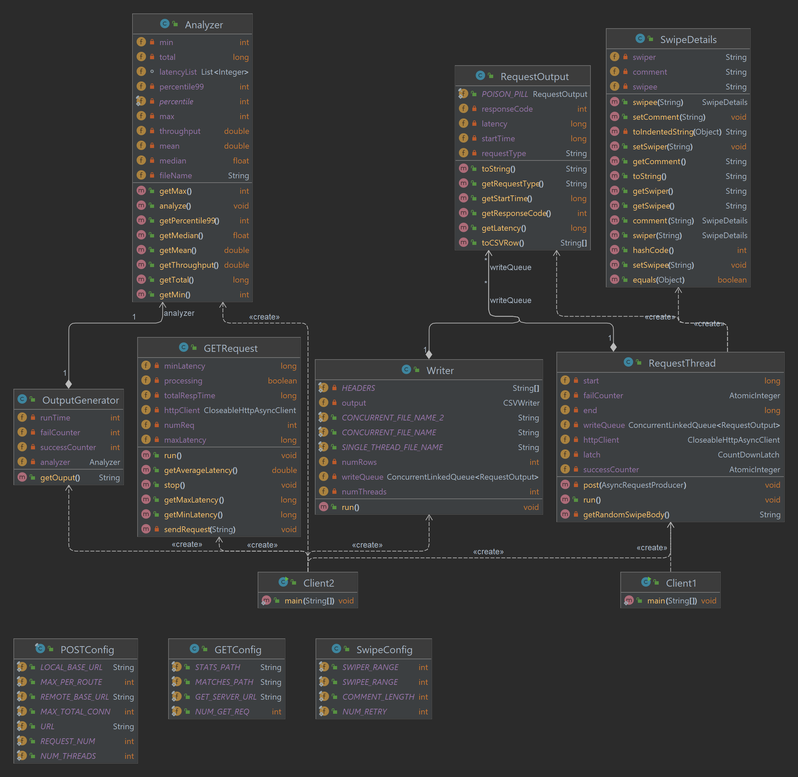
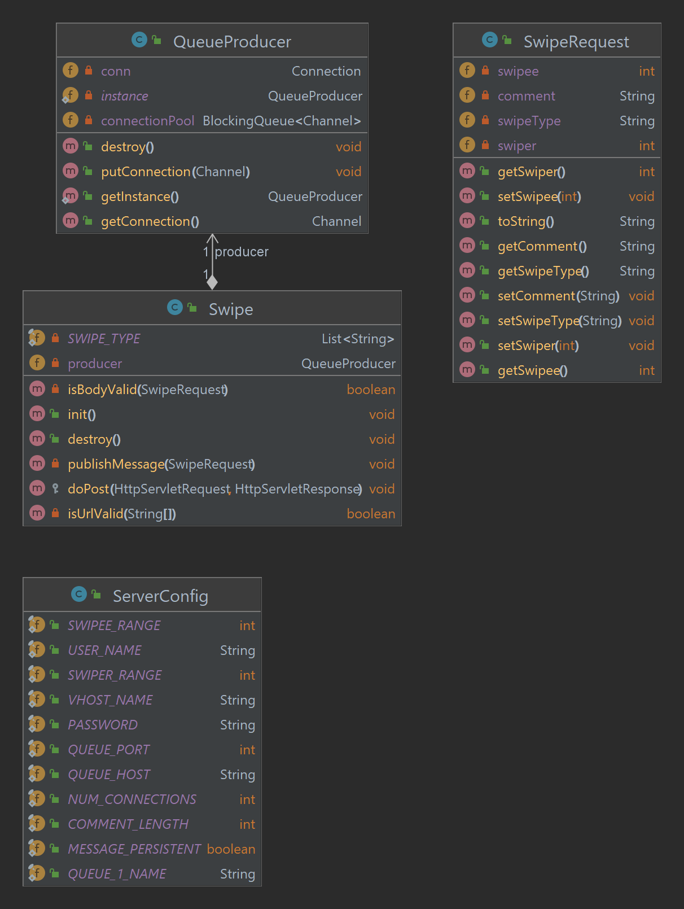
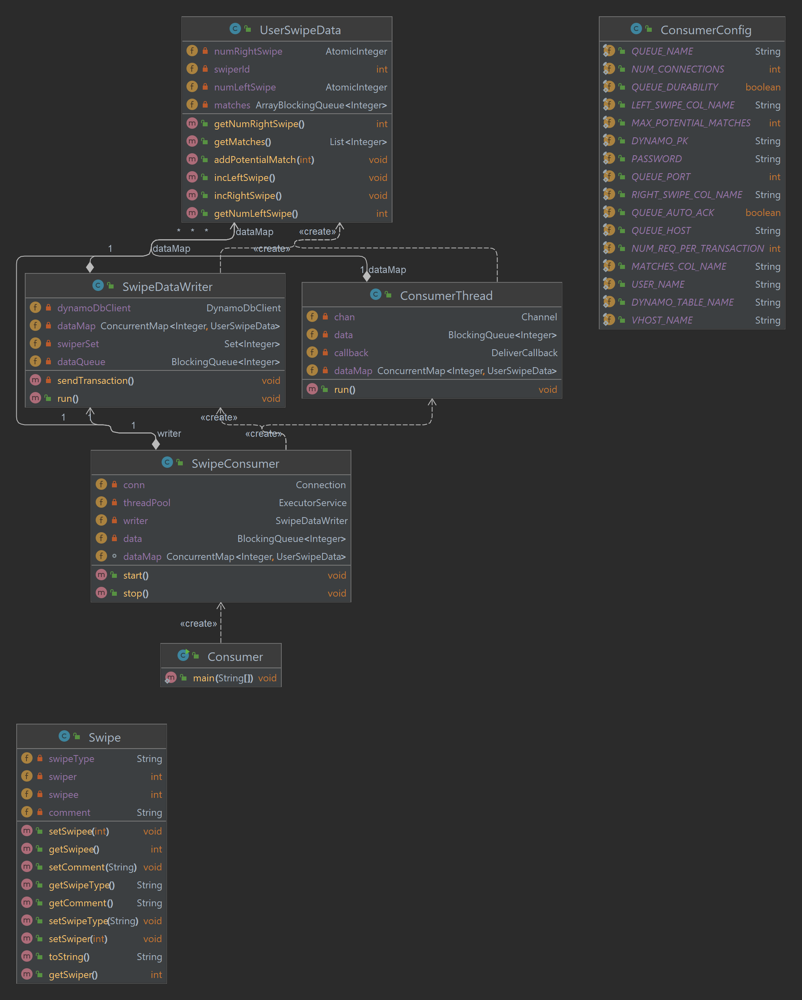
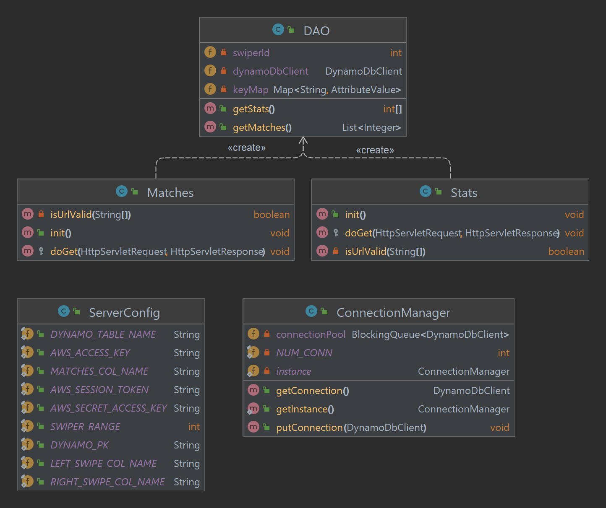

# NEU-CS6650 - Assignment 3
This assignment's implementation focuses on making the swipe data persistent. Requests sent from the Client to POST server will then be queued in RabbitMQ, consumed by the consumer and put to DynamoDB table. Any call to GET server will have it retrieve the data from DynamoDB using DAO class.

## Solution Architecture

## 1. Client UML

## 2. POST Server UML

## 3. Consumer UML

## 4. GET Server UML
